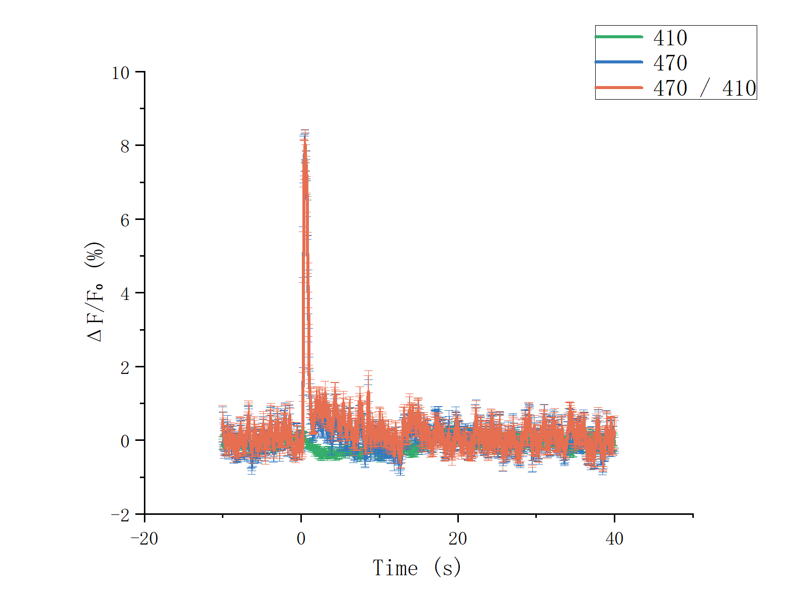

# Fiber CSV Plot Builder for Origin

一个面向 Origin 2022 的 CSV 数据导入与作图应用，适合将 AAPlot Fiber 输出结果快速接入 Origin。

## 作者与致谢

**本项目由 nexsrust 编写，并使用 ChatGPT 辅助开发。**

- Author: **nexsrust**
- Development assistance: **ChatGPT**

## 功能

- 选择文件夹中的任意多个 CSV 文件。
- 为每个 CSV 单独选择需要导入的数据列。
- 自由安排作图数据并指定 X、Y 和 Y Error 列。
- 支持曲线、散点、曲线+点和柱状图。
- 每组数据可以独立选择颜色、图例名称和绘图顺序。
- 提供 AAPlot dF/F 快捷预设，可自动加入 410、470 和 470/410 Ratio 的 mean 与 SEM。
- 应用内置完整中文使用说明。

## 下载与安装

### 方法一：直接安装 OPX

1. 下载 [`Fiber CSV Plot Builder.opx`](dist/Fiber%20CSV%20Plot%20Builder.opx)。
2. 打开 Origin 2022。
3. 将 OPX 文件拖入 Origin 主窗口。
4. 重新打开 **View → Apps**，点击 **Fiber CSV Plot Builder**。

也可以在 Origin 中选择 **Tools → Package Manager → Install a Package**，然后选择 OPX 文件。

### 方法二：使用安装脚本

下载整个 `dist` 文件夹，关闭 Origin 后双击 `安装到 Origin.cmd`。

## 使用流程

1. 在“1 导入数据”中选择包含 CSV 的文件夹。
2. 选择需要导入的 CSV，并为每个文件选择数据列。
3. 点击“导入所选数据到 Origin”。
4. 在“2 作图设置”中指定数据来源、X、Y、Y Error、图形类型和颜色。
5. 将各组数据加入作图列表并调整顺序。
6. 点击“在 Origin 中创建图形”。

更详细的中文说明见 [`docs/使用说明.txt`](docs/%E4%BD%BF%E7%94%A8%E8%AF%B4%E6%98%8E.txt)，也可以点击应用顶部的“中文使用说明”。

## AAPlot 快捷预设

对于 `event_aligned_average.csv`，应用可以自动识别并安排：

- `410_dff_percent_mean` + `410_dff_percent_sem`
- `470_dff_percent_mean` + `470_dff_percent_sem`
- `ratio_470_410_dff_percent_mean` + `ratio_470_410_dff_percent_sem`

所有曲线均可单独删除、改色、改图例或更换图形类型。

## 示例



可在 [`examples/Fiber_CSV_Plot_Builder_demo.opju`](examples/Fiber_CSV_Plot_Builder_demo.opju) 中查看完整 Origin 示例项目。

## 项目结构

```text
src/       Origin App 源码与配置
dist/      可直接安装的 OPX 和安装脚本
docs/      中文说明与示例图片
examples/  Origin 示例项目
```

## 兼容性

- OriginPro 2022
- Origin 内置 Python 3.8 / `originpro`

本版本已使用 AAPlot 导出的 `event_aligned_average.csv` 验证 410、470、Ratio 曲线、SEM 误差线和独立配色。
